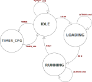

-------------------------------------------------------
### Viewing the virtual lab
To view the virtual lab connect to the Swansea University [VPN](http://vpn.swansea.ac.uk/) and navigate in your favourite browser to 
```
http://cs-s-fleming-pc.swan.ac.uk:4000
```
Any issues accessing the virtual lab display contact please post a query in the ```raise-your-hand``` channel in the lab Discord.

-------------------------------------------------------
### Communicating with your device
Commands are sent to your dotDevice from your ESP32 via WebSockets to the central EmSys Lab server. The address of the EmSys Lab server is ```ws://192.168.1.3``` Please refer to the [Lab1 handout](https://github.com/STFleming/EmSys_Lab1) for how to establish the websocket connection.

The command format is a JSON formatted string with the following format:
```
{
        "device": "<YOUR DEVICE NAME>",
        "cmd": "<COMMAND YOU WISH TO EXECUTE>",
        <AUXILLARY COMMAND SPECIFIC ARGUMENTS>
}
```

Where ```<YOUR DEVICE NAME>``` is a unique name for your device that has been assigned to your device. If you do not know the name of your device please post a query in the ```raise-your-hand``` lab Discord channel.

Commands are split into two categories, __ACTION__ and __CONFIG__ commands. __ACTION__ commands are used to manipulate how your device is shown on screen, as __CONFIG__ commands are used to alter the internal state of your device. (See Section _"Programming your dotDevice"_ for more information on __CONFIG__ commands). 

The tables below contains a list of commands that you can send to your device in the ```<COMMAND YOU WISH TO EXECUTE>``` field. It also contains details on the ```<AUXILLARY COMMAND SPEFIC ARGUMENTS>``` for each command.
In all the examples we shall use the example device ```C0FFEE```.

| __ACTION Commands__                |  __Auxillary Command Specific Arguments__ |    __Example__ |
|----------------------------|---------------------------|--------------------------------|
| __SAY__     |    ```"text" : "<TEXT TO WRITE>"``` | ```{"device":"C0FFEE", "cmd":"SAY", "text": "Hello!"} ```                                |
| __COLOUR__  |    ```"colour" : "<HEX COLOUR CODE>"``` | ```{"device":"C0FFEE", "cmd":"COLOUR", "colour": "#FFFFFF"} ```                                |
| __SIZE__    |    ```"size" : <SIZE VALUE 0 - 20>``` | ```{"device":"C0FFEE", "cmd":"SIZE", "size": 10} ```                                |
| __ADJUST_XPOS__ |    ```"dx" : <CHANGE IN X POSITION>``` | ```{"device":"C0FFEE", "cmd":"ADJUST_XPOS", "dx": 2} ```                                |
| __ADJUST_YPOS__ |    ```"dy" : <CHANGE IN Y POSITION>``` | ```{"device":"C0FFEE", "cmd":"ADJUST_YPOS", "dy": 2} ```                                |


| __CONFIG Commands__                |  __Auxillary Command Specific Arguments__ |    __Example__ |
|----------------------------|---------------------------|--------------------------------|
| __LOAD__ |    -  |  ```{"device":"C0FFEE", "cmd":"LOAD"} ```       | 
| __TIMER_CFG__ |    -  | ```{"device":"C0FFEE", "cmd":"TIMER_CFG"} ``` |
| __TIMER_VAL__ |   ```"value": <MILLISECONDS BETWEEN COMMANDS>``` | ```{"device":"C0FFEE", "cmd":"TIMER_VAL", "value":50} ``` |
| __RUN__ |    -  | ```{"device":"C0FFEE", "cmd":"RUN"} ```       |
| __HALT__ |    -  | ```{"device":"C0FFEE", "cmd":"HALT"} ```         |

-------------------------------------------------
## Programming your dotDevice

Your dotDevice is programmable, it contains a small amount of memory where 256 __ACTION__ commands can be stored and executed at a regular rate using a built in timer.  



Above shows a Finite State Machine (FSM) of your dotDevice. Your device should be initialised to the _IDLE_ state on startup. When your dotDevice is in the _IDLE_ state it can receive __ACTION__ commands and will respond to them accordingly.  

### Loading an instruction sequence on your dotDevice


Above is a diagram for the architecture of the dotDevice Instruction Memory Unit.
The command memory has a write port, where __ACTION__ commands are loaded into the memory, and a read port, where __ACTION__ commands are read from.
Writing commands is controlled via the ```Instruction Loader``` module, as reading and executing commands is controlled by the ```Execution Unit```. The rate at which the ```Execution Unit``` reads and executes commands stored in the command memory is controlled by the ```Timer Unit```. For more information on configuring the ```Timer Unit``` see the section _"Configuring the dotDevice Timer"_ below. 

The diagram shows two signals at the bottom ```state==loading``` and ```state==running```. These two signals indicate that the ```Instruction Loader``` unit is only active in the _LOADING__ state and that the ```Execution Unit``` is only active in the _RUNNING_ state (see the configuration FSM above).

### Configuring your dotDevice Timer

