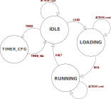

### Communicating with your device
Commands are sent to your dotDevice from your ESP32 via WebSockets to the central EmSys Lab server. The address of the EmSys Lab server is ```ws://192.168.1.3``` Please refer to the [Lab1 handout](https://github.com/STFleming/EmSys_Lab1) for how to establish the websocket connection.

The command format is a JSON formatted string with the following format:
```
{
        "device": "<YOUR DEVICE NAME>",
        "cmd": "<COMMAND YOU WISH TO EXECUTE>",
        <COMMAND SPECIFIC ARGUMENTS (CSA)>
}
```

Where ```<YOUR DEVICE NAME>``` is a unique name assigned to your device. If you do not know the name of your device please post a query in the ```raise-your-hand``` lab Discord channel.

Commands are split into two categories: __ACTION__ and __CONFIG__ commands. __ACTION__ commands are used to manipulate how your device is shown on screen, for example, movement or colour; as __CONFIG__ commands are used to alter the internal state of your device, for example, configuring the device internal timer. (See Section _"Programming your dotDevice"_ for more information on __CONFIG__ commands). 

The table below contains a list of __ACTION__ commands that you can send to your device in the ```<COMMAND YOU WISH TO EXECUTE>``` field. It also contains details on the ```<COMMAND SPECIFIC ARGUMENTS (CSA)>``` for each command.
In all the examples we shall use an example device with the name ```C0FFEE```.

| __ACTION Commands__                |  __Command Specific Arguments__ |    __Example__ |
|----------------------------|---------------------------|--------------------------------|
| __SAY__     |    ```"text" : "<TEXT TO WRITE>"``` | ```{"device":"C0FFEE", "cmd":"SAY", "text": "Hello!"} ```                                |
| __COLOUR__  |    ```"colour" : "<HEX COLOUR CODE>"``` | ```{"device":"C0FFEE", "cmd":"COLOUR", "colour": "#FFFFFF"} ```                                |
| __SIZE__    |    ```"size" : <SIZE VALUE 0 - 20>``` | ```{"device":"C0FFEE", "cmd":"SIZE", "size": 10} ```                                |
| __ADJUST_XPOS__ |    ```"dx" : <CHANGE IN X POSITION>``` | ```{"device":"C0FFEE", "cmd":"ADJUST_XPOS", "dx": 2} ```                                |
| __ADJUST_YPOS__ |    ```"dy" : <CHANGE IN Y POSITION>``` | ```{"device":"C0FFEE", "cmd":"ADJUST_YPOS", "dy": 2} ```                                |

All the commands above perform a visible action on your dotDevice: 
* ```SAY``` will cause a text messge to appear above your dotDevice for three seconds.
* ```COLOUR``` will change the colour of your device to the [hex colour value](https://www.w3schools.com/colors/colors_picker.asp) provided in the ```"colour"``` CSA. 
* ```SIZE``` will change the size of your device, to a maximum size of 20.
* ```ADJUST_XPOS``` will move the X coordinate position of the dotDevice by the amount specified in the ```"dx"``` CSA. Note you cannot move more than +-10 from your initial starting position. 
* ```ADJUST_YPOS``` will move the Y coordinate position of the dotDevice by the amount specified in the ```"dy"``` CSA. Note you cannot move more than +-10 from your initial starting position. 

The table below contains a list of __CONFIG__ commands, more details on these are specified in the _"Programming your dotDevice"_. 

| __CONFIG Commands__                |  __Command Specific Arguments__ |    __Example__ |
|----------------------------|---------------------------|--------------------------------|
| __LOAD__ |    -  |  ```{"device":"C0FFEE", "cmd":"LOAD"} ```       | 
| __TIMER_CFG__ |    -  | ```{"device":"C0FFEE", "cmd":"TIMER_CFG"} ``` |
| __TIMER_VAL__ |   ```"value": <MILLISECONDS BETWEEN COMMANDS>``` | ```{"device":"C0FFEE", "cmd":"TIMER_VAL", "value":50} ``` |
| __RUN__ |    -  | ```{"device":"C0FFEE", "cmd":"RUN"} ```       |
| __HALT__ |    -  | ```{"device":"C0FFEE", "cmd":"HALT"} ```         |

-------------------------------------------------
## Programming your dotDevice

Your dotDevice is programmable, it contains a small amount of memory where 256 __ACTION__ commands can be stored and executed at a regular rate using a built in timer.  



Above shows a Finite State Machine (FSM) of your dotDevice. Your device should be initialised to the _IDLE_ state on boot. When your dotDevice is in the _IDLE_ state it can receive __ACTION__ commands and will respond to them accordingly. In the _LOAD_ state __ACTION__ commands are not executed but are saved in the command memory. In the _RUNNING_ state commands are executed at the rate set by the ```Timer Unit``` and received __ACTION___ commands are executed. 

### Loading an instruction sequence on your dotDevice


Above is a diagram for the architecture of the dotDevice Command Memory Unit.
The command memory has a write port, where __ACTION__ commands are loaded into the memory, and a read port, where __ACTION__ commands are read from.
Writing commands into the command memory is controlled via the ```Instruction Loader``` module, as reading and executing commands is controlled by the ```Execution Unit```. The rate at which the ```Execution Unit``` reads and executes commands stored in the command memory is controlled by the ```Timer Unit```. For more information on configuring the ```Timer Unit``` see the section _"Configuring the dotDevice Timer"_ below. 

The diagram shows two signals at the bottom ```state==loading``` and ```state==running```. These two signals indicate that the ```Instruction Loader``` unit is only active in the _LOADING_ state and that the ```Execution Unit``` is only active in the _RUNNING_ state (see the configuration FSM above).

To load a command sequence into the command memory the device must enter the _LOADING_ state. 
Entering the _LOADING_ state can only be a achieved when a device is in the _IDLE_ state and has received the __LOAD__ command.
Whenever a dotDevice enters the _LOADING_ state the ```write_addr``` signal is set to zero. 
Once the dotDevice is in the _LOADING_ state any __ACTION__ command received __will not executed__ but instead will be placed into the ```command memory``` at the location ```write_addr``` by the  ```Instruction Loader```. Once the command has been written into the ```command memory``` the ```Instruction Loader``` then increments the ```write_addr``` by one, moving it onto the next address.  

The only way to leave the _LOADING_ state is to issue a __RUN__ config command. This places the dotDevice in a _RUNNING_ state, where commands are issued from the ```command memory``` at a regular interval defined by the ```Timer Unit``` ( For details on how to configure the ```Timer Unit``` please see the Section _Configuring your dotDevice Timer_ of this datasheet) 

While in the _RUNNING_ state the ```Execution Unit``` will read the command at address ```read_addr``` at every ```tick``` of the ```Timer Unit```. It will then execute the action command saved at that address and increment the ```read_addr``` by one. If the ```read_addr``` signal is the same value as the ```write_addr``` signal, then the ```read_addr``` is set to zero, restarting the command sequence. 

The only way for a device to exit the _RUNNING_ state is to receive a __HALT__ command, which places it back in the _IDLE_ state and the ``command memory``` is cleared.

### Example: load a command sequence to move a device back and forth
Assuming the device is initially in the _IDLE_ state and the device name is ```C0FFEE```.

```
        { "device":"C0FFEE", "cmd":"LOAD" }
        { "device":"C0FFEE", "cmd":"ADJUST_XPOS", "dx": 2 }
        { "device":"C0FFEE", "cmd":"ADJUST_XPOS", "dx": 2 }
        { "device":"C0FFEE", "cmd":"ADJUST_XPOS", "dx": -2 }
        { "device":"C0FFEE", "cmd":"ADJUST_XPOS", "dx": -2 }
        { "device":"C0FFEE", "cmd":"RUN" }
```

After executing these commands the device is in the _RUNNING_ state, wobbling back and forth.
Executing the following command will return the device to the _IDLE_ state where it can be reprogrammed.

```
        { "device":"C0FFEE", "cmd":"HALT" }
```
### Configuring your dotDevice Timer

To configure the ```Timer Unit``` of your dotDevice you first need to enter the _TIMER\_CFG_ state. Once in the _TIMER\_CFG_ state it is then possible to issue a __TIMER\_VAL__ command, with the period of the timer as a CSA. This then sets the period of the ```Timer Unit``` and returns the dotDevice to the _IDLE_ state.

